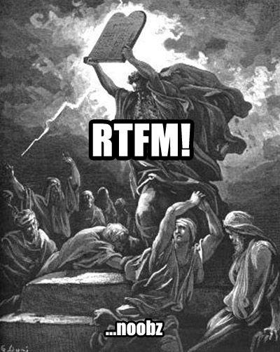

# How to debug flaky tests effectively

First watch this [YouTube video about flaky test](https://youtu.be/CL1w32iCVM4?si=7IPoTynDTPgLFgtk) which says that **there are not flaky tests**. Now let's talk about different types of flakiness:

1. Randomly passing and failing. Might be happening because of:
   - Test order: test 1 has some side affects on test 2. They are not properly isolated.
   - Some non-deterministic codes[^1].
   - External dependencies.
   - Concurrent processes.
   - Asynchronous code.
2. Environmental. Can be mitigated by a lot through using Docker. But nonetheless it could happen due to these reasons:
   - Networking issues.
   - Hardware differences.
   - Subtle runtime differences.
   - Dependency version difference.

> [!TIP]
>
> In Gitlab we have [this post](https://docs.gitlab.com/ee/development/testing_guide/unhealthy_tests.html#flaky-tests), in which we can learn about different scenarios we might end up dealing with flaky tests. **It is a very good one, read it for sure**.

## How to identify them?

1. Your VCS has some sort of tool set that shows you flaky tests. E.g. in GH we can use [this Github Actions](https://github.com/ctrf-io/github-actions-test-reporter-ctrf) to do it.

## Steps you can consider as your next action

1. **RTFM**: Whatever that's causing the test to fail, a tool, a lib, or software.

   

   No offense but I guess it is crystal clear to all of us that reading doc for 1 hour can save 6 hour of debugging. Numbers are fictional but I guess you got the message.

1. Read logs.
1. See what you've changed since last successful executed tests.
1. Break it into smaller parts.
1. Isolate the issue in a new, and isolated environment. Then try to reproduce it.
1. Use `eslint` to find out about potential bugs and errors.
1. If you're mocking something make sure that you've done it properly.

## Some YouTube videos about flaky tests

- [Flaky Tests](https://youtu.be/Gn2TcLR2Cy0?si=a08AH5LjiilFvR2j).
- [Eliminating Flaky Tests](https://youtu.be/Q4c5cvt1b3k?si=KepCcB0ty02ILxfG).
- [Flaky tests by Andrei Solntsev](https://youtu.be/18J2_4a4Cl4?si=OGfGdd7zq211NQkf).
- [GTAC 2015: Your Tests Aren't Flaky](https://youtu.be/hmk1h40shaE?si=djZh6hpdMJ7GjAdN).
- [[VDZ22] Removing complexity from integration tests using Testcontainers! by Kevin Wittek](https://youtu.be/3OqHSI6QIwA?si=d-VGc0cKip7dV0ca).

# Footnotes

[^1]: Non-deterministic code is code which can produce different outputs even when it is given the same inputs.
