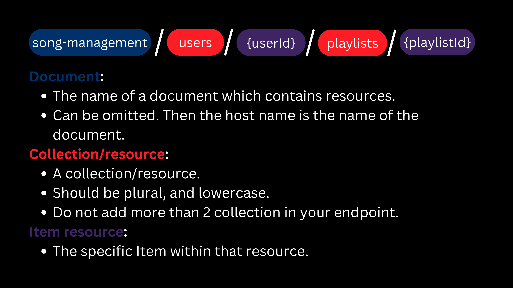
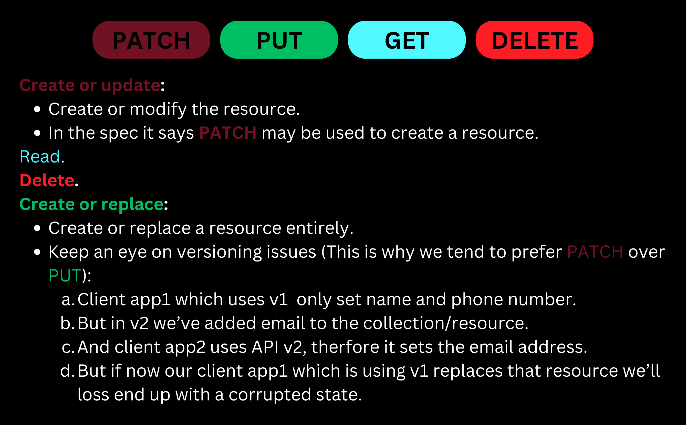
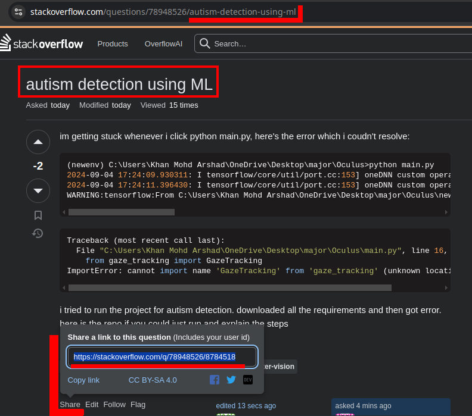
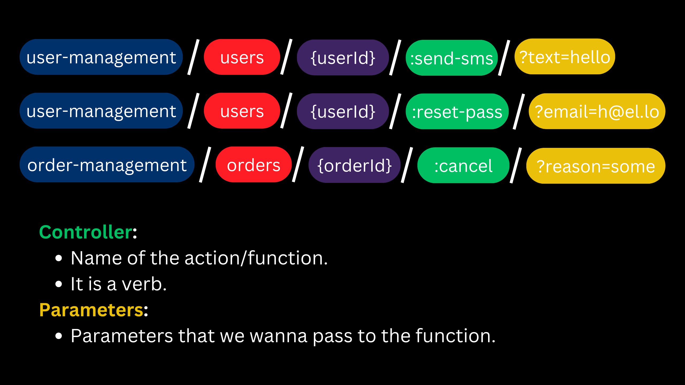

# API Designing phase

- It is crucial to invest significant design efforts into the API.
  - Note: I am a big fan of incremental improvements. So **DO NOT** go over board.
- You're building it for customers.

  - Define some "hero scenarios"[^1].
  - Get feedbacks frequently on what you're building.
  - Approach the subject from the customers perspective.

  

## Hero scenarios

- They reduce development costs.
  - No speculation, just create APIs that customers want.
  - Instead of fringy (less commonly used) features, you'll focus on main features.
- Very easy to get the needs across the team and bring everybody on the same page.
- Since we have use cases we'll have less of debates and discussions about a topic.

## Iteration on API

- Ask users to use them and give you feedback on it.
- Publish previews of you API where it contains sample data, and documentation.
- Ask an experienced architect to see at your API, thus having a consistent API throughout the entire company.

## Contracts

When designing your RESTful API it is very wise to establish a well structured standard.

### Headers & queries

- Header keys are case-**in**sensitive. But HTTP v2 mandates them to be all in lowercase. Following that, it makes sense to keep them all in lowercase.
- Avoid using `x-*` ([Read more in RFC 6648](https://datatracker.ietf.org/doc/html/rfc6648)).
- Since value of both headers and queries are string we have a very concise and precise regulations:

  | To treat string as | String value must be                                                                                                                                                                                                                                                                                         |
  | ------------------ | ------------------------------------------------------------------------------------------------------------------------------------------------------------------------------------------------------------------------------------------------------------------------------------------------------------ |
  | Boolean            | `true` or `false`.                                                                                                                                                                                                                                                                                           |
  | Integer            | -2<sup>53</sup> to 2<sup>53</sup>+1. Do not go beyond this length since it might loos precision.                                                                                                                                                                                                             |
  | Float              | [IEEE-754](https://ieeexplore.ieee.org/document/8766229).                                                                                                                                                                                                                                                    |
  | String             | Is it quoted or not? Is it case-sensitive or not? How long it can be? Can it be multiple string, if yes what's the delimiter? Does whitespace matter or not?                                                                                                                                                 |
  | UUID               | [RFC4122](https://datatracker.ietf.org/doc/html/rfc4122).                                                                                                                                                                                                                                                    |
  | Date/time          | For headers look at [RFC1123](https://datatracker.ietf.org/doc/html/rfc1123#section-5.2.14) and as for query string follow [RFC3339](https://datatracker.ietf.org/doc/html/rfc3339) which in short is `YYYY-MM-DDTHH:mm:ss.sssZ`. Note that we are limiting the milliseconds resolution to 3 decimal number. |
  | Durations          | P[n]Y[n]M[n]DT[n]H[n]M[n]S ([RFC3339](https://datatracker.ietf.org/doc/html/rfc3339)).                                                                                                                                                                                                                       |
  | Byte array         | Should be base-64 encoded string. And with a defined max length.                                                                                                                                                                                                                                             |

## Review process

1. Does the API matches these general expectations:
   - Are the URLs properly formed?
   - Do they have idempotency?
   - Are they atomic?
   - Are the JSONs correctly formed?
   - Do they follow same casing (camelCase)?
   - Are you returning the right status code?
   - Is pagination implemented for lists?
   - Do you have setup your service for "long running operations"?
2. Is it consistent with the rest of the APIs?
3. Is it sustainable?
   - No breaking changes (keep it to a minimum).
4. Check for performance issues.

# Idempotency

- In the cloud computing world we're all out just in search of remaining fault-tolerant.
  - Your cloud provider might face some technical issues.
  - Scaling down without waiting for received request to be processed.
  - You're upgrading your app in this fashion that the old app goes down suddenly and the new one goes live.
  - Or your client app has some sort of network issue, assume it is a car which goes into the parking and thus loosing its connection for some time.
  - And many more reasons.
- So we know that there are numerous reasons that might cause our client's request to have no response. As such we wanna enable our clients to be able to retry the requests. Meaning that our backend is implemented with idempotency in mind.
- HTTP spec says that most HTTP methods should be idempotent.

> [!TIP]
>
> If you're developing a client library for your API, try to define a timeout so that your frontend app (or whoever is using your client library) won't hang indefinitely.

## What's idempotent

An endpoint is idempotent when retrying a request has the same intended affect, even if the original request succeeded. But the response might differ.

| Method   | Description                           | Status code               |
| -------- | ------------------------------------- | ------------------------- |
| `PUT`    | Create/replace the whole resource.    | 200-OK/201-Created.       |
| `PATCH`  | Modify the resource with Patch-merge. | 200-OK.                   |
| `GET`    | Read the resource.                    | 200-OK.                   |
| `DELETE` | Remove the resource.                  | 200-OK or 204-No content. |

- Learn more about the [differentiation between PUT and PATCH here](https://dev.to/kasir-barati/patch-vs-put-2pa3).

> [!CAUTION]
>
> For the `DELETE` if it did find the resource and deleted it we're gonna return 200 HTTP status code.
>
> But if it could not find the resource we should return 204 HTTP status code so that our client won't retry. Remember that the whole idea behind idempotency was to allow our client retry the request if it did fail or did not receive a proper response from the server. But **404** add confusion to our idempotent RESTful API.
>
> **So the bottom line for DELETE is to avoid using 404 HTTP status code**.

# REST

- **RE**presentational **S**tate **T**ransfer.
- Emphasizes on qualities such as:
  1. Security.
  2. Generality.
  3. Scalability.
  4. Independence of deployment.
  5. Reduced latency through caching.
- Spending some time to come up with a good URL is critical.
  - URL are as their name suggest is a Unified Resource Locator. Thus helping us to locate different resources on the server.
  - They should not be susceptible to constant changes.
- We have resources which are usually our database tables/collections.
  - They're nouns and not behaviors.
  - The only behaviors are: `Create`, `Read`, `Update`, and `Delete`.
- Learn more about REST [here](https://github.com/kasir-barati/you-say/tree/main/.github/docs/REST#restful-apis).

## CRUD

- Dissecting an endpoint:

  

- Body: holds the resource state.
- <a id="httpMethods" href="#httpMethods">#</a> HTTP methods:

  

## A complete example for `airports` resource.

1. We have our database table/collection:

   | Field             | Data type | Set by  | Mutability |
   | ----------------- | --------- | ------- | ---------- |
   | `airportCode`     | string    | client  | create     |
   | `createdAt`       | string    | service | read       |
   | `runways`         | number    | client  | update     |
   | `takeoffsPerHour` | number    | client  | update     |

   Mutability:

   - <a id="createMutability" href="#createMutability"># </a>**"create"** here means that our data is modifiable only at creation time, i.e. `airportCode`.
   - <a id="readMutability" href="#readMutability"># </a>**"read"** fields are the ones managed and controlled soly by server. So if you send it in a `PUT`/`PATCH` you'll see an error.
     - E.g. `createdAt`.
     - Note: this is not the same as whitelisting. Here we wanna explicitly prohibit users from touching it. Can be ignored and just whitelisted since most of the APIs that we develop ain't public facing APIs.
   - **"update"** signifies that you can change that field over the lifetime of a record/document. E.g. `runways` and `takeoffsPerHour`.

2. Requests:

   **Create**

   ```shell
   PATCH /airports/LAX

   { "runways": 4 }
   ```

   Here if there were no records/documents with that same `airportCode` we'll create one, otherwise we'll modify the one with that `airportCode`. So our table now looks like this:

   | `airportCode` | `createdAt`             | `runways` | `takeoffsPerHour` |
   | ------------- | ----------------------- | --------- | ----------------- |
   | HND           | 2000-12-22 21:05:15.723 | 10        | 3000              |
   | LAX           | 1994-12-22 21:05:15.723 | 4         |                   |

   **Update**

   ```shell
   PATCH /airports/LAX
   content-type: application/merge-patch+json

   { "takeoffsPerHour": 2000 }
   ```

   So now with this HTTP request our resource's state will be:

   | `airportCode` | `createdAt`             | `runways` | `takeoffsPerHour` |
   | ------------- | ----------------------- | --------- | ----------------- |
   | HND           | 2000-12-22 21:05:15.723 | 10        | 3000              |
   | LAX           | 1994-12-22 21:05:15.723 | 4         | 2000              |

   **Read**

   ```shell
   GET /airports/LAX
   ```

   <a id="responseBodySchemaForRead" href="#responseBodySchemaForRead">#</a>
   The response body will contains LAX's info:

   ```json
   {
     "airportCode": "LAX",
     "createdAt": "1994-12-22 21:05:15.723",
     "runways": 4,
     "takeoffsPerHour": 2000
   }
   ```

   **List**

   ```shell
   GET /airports/
   ```

   <a id="responseBodySchemaForList" href="#responseBodySchemaForList">#</a>
   The response body could look like this:

   ```json
   {
     "data": [
       {
         "airportCode": "HND",
         "createdAt": "2000-12-22 21:05:15.723",
         "runways": 10,
         "takeoffsPerHour": 3000
       }
       {
         "airportCode": "LAX",
         "createdAt": "1994-12-22 21:05:15.723",
         "runways": 4,
         "takeoffsPerHour": 2000
       }
     ],
     "nextLink": "https://example.com/api/airports?cursor=f23as4GS126po5LK4Fdf"
   }
   ```

   **Note**: While we are paginating our resources for a specific client, another client might add or remove something. That's why it is crucial that our client is programmed robustly enough so it can handle skipped, or duplicated data.

   We have 3 kinds of pagination:

   1. <a href="#cursorBasedPagination" id="cursorBasedPagination">#</a> Server-driven pagination (cursor-based pagination):
      - This gives our server more control and can be utilized where we are serving different clients and server is not up to the task of dealing with pagination on top of other tasks it has to complete.
      - In the example above the `nextLink` is URL to the next page, it can contains query strings as well.
      - No `nextField` means that we've reach the end of the road.
   2. Client-driven pagination (offset-based pagination): enables our client to have a finer grasp over what is being returned. Good for when we have a very tight requirements in our client app.
   3. Or we can use both.

   **Filtering, sorting, and paginating**:

   TBF I am not sure if I have ever though this way.

   1. Server must evaluate the filtering first (so we have applied filters).
   2. We need to apply `order by`s specified by client.
      - **Caution**: Order by is supper expensive. So you might wanna consider to not implement it.
   3. We can skip part of it.
   4. Lastly we wanna return the page that user have asked for it.

   I am not totally sold on the idea that these SQL/MongoDB queries but nonetheless I thought it would be really helpful:

   ```sql
   SELECT *
   FROM users
   WHERE status = 'active'
   ORDER BY created_at DESC, username ASC
   LIMIT 10
   OFFSET 20;
   ```

   ```js
   db.collection("users")
     .find({ status: "active" })
     .sort({ created_at: -1, username: 1 })
     .skip(20)
     .limit(10);
   ```

   **Delete**

   ```shell
   DELETE /airports/LAX
   ```

   This will try to find a record/document in the database and remove it. Here we're not returning any response and the response status code will be 200 or 204. Our database after this request:

   | `airportCode` | `createdAt`             | `runways` | `takeoffsPerHour` |
   | ------------- | ----------------------- | --------- | ----------------- |
   | HND           | 2000-12-22 21:05:15.723 | 10        | 3000              |

## JSON resource schema

- You need to have a schema defined for any given endpoint.
- This schema will be data type that our client library uses.
- This schema is the one that we're gonna use:
  - In `PUT`/`PATCH` requests to update/replace the data.
  - In a `GET` request to retrieve the data.
- In a JSON we support only:
  1. Booleans.
  2. Numbers: Signed floating point number which fits withing the range of [IEEE-754](https://ieeexplore.ieee.org/document/8766229). And as for integers try to stay withing this range [-2<sup>53</sup>, 2<sup>53</sup>+1].
  3. Strings: covers all other types that we do not support in JSON, e.g. date, time, UUID, etc. And remember that they should be round-trippable[^2].
  4. Objects.
  5. Arrays: Avoid using them since they won't work very well with JSON merge patch. Instead use maps. Note: I am not sure how we can do it and how we should implement it. Just wanted to add it here. Maybe later I'll add a link to how you should implement it.
- Consider these things before using enums in your API:
  - In some programming languages enums are treated as numbers. So making sure that they're not sent as numbers over the wire.
  - Adding/removing values in different versions might cause your client to crash.
  - But if it is not persisted then you can use it. By persistence I mean storing it in database.
- Try to avoid discriminated/polymorphic types, but if you have to have one follow this pattern or something similar to this:

  ```ts
  interface Shape {
    kind: string;
    lineColor: string;
    fillColor: string;
    subscription: Subscription;
  }
  interface Subscription {
    kind: string;
    expiration: Date;
  }
  interface FreeSubscription extends Subscription {}
  interface PaidSubscription extends Subscription {
    invoiceId: string;
  }
  interface Rectangular<SubscriptionType extends Subscription> extends Shape {
    x: number;
    y: number;
    width: number;
    length: number;
    subscription: SubscriptionType;
  }
  interface Circle<SubscriptionType extends Subscription> extends Shape {
    x: number;
    y: number;
    radius: number;
    subscription: SubscriptionType;
  }
  const rawResponseBody: Shape = {
    fillColor: "",
    kind: "rectangle",
    lineColor: "",
    subscription: { expiration: new Date(), kind: "paid" },
  };
  if (isRectangular(rawResponseBody) && isPaidSubscription(rawResponseBody.subscription)) {
    const rectangularWithPaidSub = rawResponseBody as Rectangular<PaidSubscription>;
  } else if (/* rest of them */) {
  }
  function isRectangular(shape: Shape): shape is Rectangular<Subscription> {
    return shape.kind === "rectangle";
  }
  function isCircle(shape: Shape): shape is Rectangular<Subscription> {
    return shape.kind === "circle";
  }
  function isPaidSubscription(
    subscription: Subscription
  ): subscription is PaidSubscription {
    return subscription.kind === "paid"
  }
  function isFreeSubscription(
    subscription: Subscription
  ): subscription is FreeSubscription {
    return subscription.kind === "free"
  }
  ```

### Processing of a `PUT`/`PATCH` request

1. The preliminary validations:

   | HTTP method   | Request contains                            | HTTP status code |
   | ------------- | ------------------------------------------- | ---------------- |
   | `PUT`/`PATCH` | Unknown/invalid JSON field names or values. | 400-Bad request. |
   | `PUT`/`PATCH` | [Read](#readMutability) fields.             | 400-Bad request. |

2. Now we have two scenarios:

   - The resource does not exist on the server:

     | HTTP method   | Request                                          | HTTP status code |
     | ------------- | ------------------------------------------------ | ---------------- |
     | `PUT`/`PATCH` | Misses some mandatory fields for create/replace. | 400-Bad request. |

     And now that we've made sure the request is valid we can create it and return a 201-Created status code.

   - The resource exists on the server:

     | HTTP method   | Request                                      | HTTP status code |
     | ------------- | -------------------------------------------- | ---------------- |
     | `PUT`/`PATCH` | Contains [create](#createMutability) fields. | 400-Bad request. |
     | `PUT`         | Misses some mandatory fields.                | 400-Bad request. |

     If we passed all those steps then we can go ahead and modify/replace the record/document.

And if you're wondering should you use 400 or 422 please read [this Stackoverflow Q&A](https://stackoverflow.com/q/16133923/8784518).

### Processing an HTTP request in general

| Scenario                       | HTTP status code          |
| ------------------------------ | ------------------------- |
| Something unexpected happened. | 500-Internal server error |

Note that from here on out these check are done in the order that they are listed here, those who are defined first will be checked first.

| Order | Check                                                     | HTTP status code               |
| ----- | --------------------------------------------------------- | ------------------------------ |
| 1     | Server is booting/too busy/shutting down.                 | 503-Service unavailable        |
| 2     | HTTP version.                                             | 505-HTTP version not supported |
| 3     | Authorization.                                            | 401-Unauthorized               |
| 4     | Client making too many requests per second.               | 429-Too many requests          |
| 5     | URL too long.                                             | 414-URI too long               |
| 6     | HTTP method is not supported.                             | 501-Not implemented            |
| 7     | Resource is not accessible to the client (permission).    | 403-Forbidden                  |
| 8     | Resource does not support this HTTP method at the moment. | 405-Method not allowed         |
| 9     | `accept` header is `application/json`.                    | 406-Not acceptable             |

> [!CAUTION]
>
> I am not sure if we wanna perform all of these checks since I guess you'd agree with me that most of them ain't necessarily a must for most RESTful APIs we design.

> [!TIP]
>
> How #6 is different from #8? I can shed light on this by explaining the #8 a bit more. Let's say our server receives a PUT request from client1 and now is in the middle of processing that request, then clientB sends another request to delete that same resource. So in this case server can return `405` HTTP status code so that client can retry it after the previous request process is completed.
>
> **Note: In NodeJS we need to have some sort of mechanism to do it, I mean some sort of locking the resource.**

### Rest of remaining validations

<table>
  <thead>
    <tr>
      <th>HTTP method</th>
      <th>Check</th>
      <th>HTTP status code</th>
    </tr>
  </thead>
  <tbody>
    <tr>
      <td><code>GET</code></td>
      <td>
        If
        <a href="https://httpwg.org/specs/rfc9110.html#field.if-none-match">
          <code>if-none-match</code> header
        </a>
        exists.
      </td>
      <td>
        200 + requested resource only if it doesn't have an
        <code>etag</code> matching the given ones.
        <br />
        Or 304 if they match. <a href="#etag">Learn more about ETag here</a>
      </td>
    </tr>
    <tr>
      <td>
        <code>PUT</code>, <code>POST</code>,
        <code>PATCH</code>
      </td>
      <td>If <code>content-length</code> is missing.</td>
      <td>411-Length required.</td>
    </tr>
    <tr>
      <td>
        <code>PUT</code>, <code>POST</code>,
        <code>PATCH</code>
      </td>
      <td>If <code>content-length</code> is too big.</td>
      <td>413-Request entity too large.</td>
    </tr>
    <tr>
      <td>
        <code>PUT</code>,
        <code>POST</code>
      </td>
      <td>If <code>content-type</code> is <code>application/json</code>.</td>
      <td>415-Unsupported media type.</td>
    </tr>
    <tr>
      <td>
        <code>PATCH</code>
      </td>
      <td>
        If <code>content-type</code> is
        <code>application/merge-patch+json</code>.
      </td>
      <td>415-Unsupported media type.</td>
    </tr>
    <tr>
      <td>
        <code>PUT</code>, <code>POST</code>,
        <code>PATCH</code>
      </td>
      <td>
        If request body is a valid JSON. Although I had never done this part
        manually. I mean NestJS will throw a 400 error automatically if instead
        of JSON it receives something else.
      </td>
      <td>400-Bad request.</td>
    </tr>
    <tr>
      <td>
        <code>PUT</code>,
        <code>PATCH</code>
      </td>
      <td>
        If the passed ID is not creatable.
        <b>
          TBF I am not 100% onboard with this idea. I would have throw a 400
          error. My logic is that we're giving the control of ID creation to the
          client and as such if they're providing invalid ID it is their fault
          from where I stand.
        </b>
      </td>
      <td>404-Not found.</td>
    </tr>
    <tr>
      <td><code>PATCH</code>, <code>DELETE</code></td>
      <td>If resource is not in updatable/deletable state.</td>
      <td>409-Conflict.</td>
    </tr>

  </tbody>
</table>

## Response body schema

Up until now we've kinda briefly touched this topic for the response body:

1. When [fetching a list of resources](#responseBodySchemaForList).
2. [Fetching a single resource](#responseBodySchemaForRead).
3. For update you could return the final state of the resource. It'll be the same structure as for when client requests a single resource.
4. For a delete operation, you could return nothing in the response body, or you can opt to return the state of the resource that was deleted.
5. Finally for error we have two options:

   1. Let the framework take care of it for you. That's what I do. I just let NestJS throw errors as it pleases.
   2. Customize it and follow one of these standards:
      - [RFC 7807](https://datatracker.ietf.org/doc/html/rfc7807).
      - [OData error](https://docs.oasis-open.org/odata/odata-json-format/v4.0/os/odata-json-format-v4.0-os.html#_Toc372793091).

   Use error codes in your response beside the human readable error message.

> [!CAUTION]
>
> Notes:
>
> - Your **error code** should not change from version to version since it introduces breaking changes.
> - For the "RFC 7807" I did not find error code in the response.
> - You can repeat the error code in a custom response header so to lessen the work that your client had to do. Parsing response body is not necessary anymore in that case.

## Resources

- Identify resources through an immutable and stable identity.
- E.g. you can have a slug for your posts, or a username for user but these ain't the identifier of those resources. Take a look at Stackoverflow. We have slugs in the browser's address bar. But when I click on the share button it will gimme a unique identifier for that answer or question.

  

- <a id="applicationMergePatchJson" href="#applicationMergePatchJson">#</a> Update a resource with `application/merge-patch+json`:

  User resource -- its state before update:

  ```json
  {
    "id": "66d8536a59f8092b48002360",
    "address": "68 Fukakusa Yabunouchicho, Fushimi Ward, Kyoto, 612-0882, Japan",
    "name": "Mohammad Jawad Barati",
    "phone": {
      "home": "+81756417331"
    }
  }
  ```

  Now we're gonna send a JSON merge patch request

  ```shell
  PATCH /users/66d8536a59f8092b48002360
  content-type: application/merge-patch+json

  {
    "address": "11 Osakajo, Chuo Ward, Osaka, 540-0002, Japan",
    "phone": {
      "home": null,
      "mobile": "+81635253163"
    }
  }
  ```

  Here is a summary of what we did in the previous request:

  1. <a id="nullInJsonMergePath" href="#nullInJsonMergePath">#</a> sending `null` in JSON merge path indicates that we wanna delete that field.
  2. We modified the address to a new value.
  3. We deleted the home phone number.
  4. We've added mobile phone number.

  And as such our resource looks like this now:

  ```json
  {
    "id": "66d8536a59f8092b48002360",
    "address": "11 Osakajo, Chuo Ward, Osaka, 540-0002, Japan",
    "name": "Mohammad Jawad Barati",
    "phone": {
      "mobile": "+81635253163"
    }
  }
  ```

  Benefits of JSON merge patch:

  - Atomic.
  - Idempotent.
  - uses camelCase notation.
  - Version safe update (Remember the example we've discussed [here](#httpMethods)).

  **Note**: Do not use `null` as valid value for a field ([here](#nullInJsonMergePath)).

# Etag

An ETag (Entity Tag) is a unique identifier assigned by the server to a specific version of a resource. When a client first requests a resource, the server can respond with the resource and an ETag header. This ETag value represents the current state of the resource (ETag changes whenever the resource is updated).

It can be:

- A computed hash value of the resource.
- An monotonically increasing number after each change.

**Note**: Adding it to the response body can prove beneficial
since if you fetch a list of the resource, client needs to know
ETag value for each resource.

Use cases:

- **Really shine when our resource is large in size**, so for resources which are small this might not make too much sense.
- To have write only resource. `if-none-match: *` tells server to create a resource only when we are sending a request with `PUT`/`PATCH` HTTP method.
  In other word we are prohibiting them from modifying resources.
- <a id="optimisticConcurrentPattern" href="#optimisticConcurrentPattern">#</a> Implement _optimistic concurrent pattern_:
  We have 3 clients: client1, client2, and client3.

  1. Client1 fetches data, do some update and send a JSON merge patch request.
  2. Then we have client2 and client3 that also had fetched the data (at the same time that client1 did).
  3. So they all got the same data.

  Now:

  1. Client1 sends a JSON merge patch request.
  2. Right after that client2 sends a JSON merge patch request.
  3. Lastly client3 sends a JSON merge patch request.

  So here is where the ETag can shine. We can check if the ETag
  is not equal to what we have on the server we're gonna reject the
  request sent by the client2 and client3 with "412-Precondition
  failed" HTTP status code.

  They need to fetch data first, to have the updated version
  of the resource. Then if they still wanted to update the
  data they can perform a new JSON merge patch request.

The client stores the ETag value and sends it back to the server in subsequent requests using the If-None-Match header. The server then compares the ETag value sent by the client with the current ETag of the requested resource.

If they match, it means the resource has not changed, and the server can respond with a 304 Not Modified status, indicating that the client can use the cached version.

# HTTP `POST` method or performing an action

- REST stands for "REpresentational **State** Transfer", that's exactly why we have CRUD operations (they're only interested in the state).
- But something like sending a SMS won't fall into that category, for these kind of actions we use `POST`.
- `POST` according to HTTP spec does not need to be idempotent but in cloud env we have to make it idempotent.
- You do not wanna charge customer for the same thing twice, right?



# Throttling client request

| Scenario                                                  | HTTP status code         |
| --------------------------------------------------------- | ------------------------ |
| Server is overloaded (quota > requests per unit of time)? | 503-Service unavailable. |
| Tenant exceeds its quota?                                 | 429-Too many requests.   |

- Fail fast.
- <a id="retryAfter" href="#retryAfter">#</a> Add `retry-after: 5` response header. Client might respect it or ignore it.

> [!TIP]
>
> **Add a request id to each request** and store the logs associated with that request ID so that when a customer opens a ticket you can trace back the requests and support them.
>
> Include the request id to the response header, enabling users to share it with us.

> [!TIP]
>
> **Send and log the telemetry**. It identifies the request was made from:
>
> - Which SDK version? in which language? language version
> - Which OS, what was its version?
> - Etc.
>
> You can have your own custom `x-telemetry` header or use `user-agent` header. Note that since this header os gonna stay the same for the same SDK, no matter how many times they are calling our API we might wanna log it only once. But if you wanna add additional data that maybe are specific to a certain situation, you can add them to a different custom request header.
>
> Its structure can be something like this: `AppName/AppVersion restApiNamesdk-programmingLanguage/sdkVersion (frameworkVersion; OSVersionAndType)`.
>
> E.g. `you-say-mobile/12.0.212 you-say-sdk-js/1.2.3 (Node 22.8.0; Manjaro; Linux x86_64; rv:34.0)`
>
> By storing these data we can answer question like:
>
> - How many customers calling into me are using JavaScript?
> - Which applications are using our API?
> - We had a bug in SDK version 1.2.3, we fixed it in version 1.3.3. How many users are still using SDK version 1.2.3?
> - And more useful info.

# Distributed tracing between microservices

- We receive a request and then call a bunch of microservices to serve the client. Now we need to trace the request between microservices and how long it took that microservice to process it.

# Versioning API

- Consider customer's feeling before introducing a new version:
  - Too much breaking changes!
  - SDK keeps changing... Makes maintenance hard.
  - It updates so often it is difficult to pin down software integration.
  - Frequent API changes are annoying.
- It can be specified in query string or request headers.
  - **DO NOT** put it as part of the URL path.
    - The purpose of URL path is to distinguishes resources from each other.
    - And it is not like this that we have different version of resources, but rather different behaviors.
  - E.g. `Accept-version: 2022-12-12`
  - or `?api-version=v2.1.2`
- Famous patterns: `v1`, `2012-12-12`.
  - You can add `-preview` suffix to differentiate the features that ain't stabilized but published.
  - But in general it can be:
    - Dates.
    - Seasons.
    - Project names.
- Breaking changes include:
  - A change in the format of the response data for one or more calls.
  - A change in the request or response type (i.e. changing an integer to a float).
  - Removing any part of the API.

## Considerations before introducing a new version

1. New version should not break incoming requests.
2. Your client should be able to adopt the new version without any code change. Unless they wanna use some of the newly added features.

> [!NOTE]
>
> API versioning is a [misnomer](https://dictionary.cambridge.org/dictionary/english/misnomer). We're justing adding new APIs and telling our users that the new version is preferred but **NOT** mandatory.
>
> Another things is that our new version should run alongside the old ones.
>
> **Resource state should be backward & forward compatible.** E.g. changing a string field max length is a bad idea since the new API version can pick up on that and will conform with that requirement but the older versions cannot do the same. So our app might crash or client's app.

> [!CAUTION]
>
> If you have ever changed the API contracts (request body, query string, response body, etc) change the API version too. This prevents any potential confusion.

# Glossary

<dl>
  <dt>What is OpenAPI?</dt>
  <dd>A specification.</dd>
  <dd>A YAML/JSON file.</dd>
  <dd>It used to be called Swagger.</dd>
  <dd>Enables you to describe how your service's contract look like.</dd>
</dl>

# Footnotes

[^1]: A specific use case or user journey that represents the primary or most common way your API will be used. It's a scenario that captures the core functionality or the most important workflow that the API is meant to support.
[^2]: A round-trippable value is convertible from string to a specific data type in a programming language and back to string from that data type again. A date string which follows ISO 8601 is round-trippable since you can convert it to a Date type in a programming language and convert it back to ISO 8601 string again.
