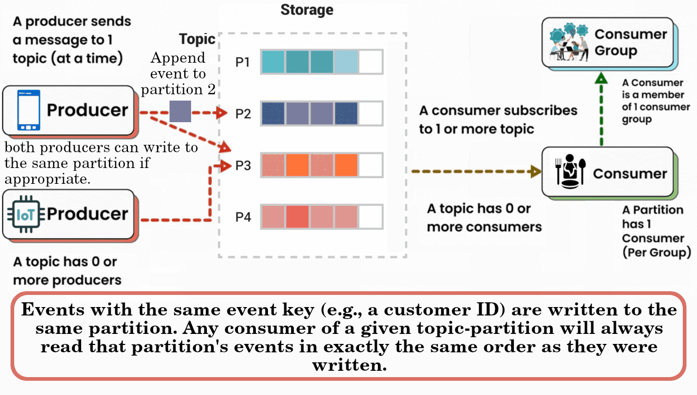

# Kafka

- AKA Apache Kafka.
- Open-source distributed event streaming platform.
- Ensuring a continuous flow and interpretation of data so that the right information is at the right place, at the right time.
- Battle-tested, [distributed][distributed-link], [highly scalable](scalability-link), [elastic][elastic-link], [fault-tolerant](fault-tolerant-link), and secure solution.
- Can be deployed on bare-metal hardware, virtual machines, and containers.
- Supports on-premise servers and cloud environments.

## Event streaming

- Digital equivalent of the human body's Central Nervous System ([CNS](https://en.wikipedia.org/wiki/Central_nervous_system)).
- Technological foundation for the 'always-on' world; where the user of software is other softwares.
- It means:
  - Capturing data in real-time.
  - From different event sources: e.g. databases, sensors, mobile devices, cloud services, and software applications.
  - In the form of streams of events.
  - To store these event streams durably for:
    - Later retrieval.
    - Manipulating.
    - Processing.
    - Reacting to the event streams in real-time as well as retrospectively.
    - Routing the event streams to different destinations.

### Event streaming use cases

- Processing payments and financial transactions in real-time (e.g. stock exchanges, banks, and insurances).
- Track and monitor cars, trucks, fleets, and shipments in real-time (e.g. logistics and the automotive industry).
- Capture and analyze sensor data from IoT devices or other equipment (e.g. inspections with robots).
- Collect and immediately react to customer interactions and orders.
- Monitor patients in hospital care and predict changes in condition.
- **Foundation for** data platforms, event-driven architectures, and **microservices**.

### Key capabilities

1. Pub/sub pattern.
2. Storing streams of events durably and reliably.
3. Live or retrospective processing.

## How it works infographic

- A distributed system consisting of [servers](./README.md#serverDefinition) and clients.
  - **Client**: SDK that read, write, and process streams of events.
- Communicates via a high-performance TCP network protocol.

### Glossary

<dl>
  <dt id="topicDefinition">
    <a href="#topicDefinition">#</a>
    Topic:
  </dt>
  <dd>A channel for categorizing data/events.</dd>
  <dt id="producerDefinition">
    <a href="#producerDefinition">#</a>
    Producer:
  </dt>
  <dd>Software that sends data to Kafka topics.</dd>
  <dt id="consumerDefinition">
    <a href="#consumerDefinition">#</a>
    Consumer:
  </dt>
  <dd>Software that receive data from Kafka topics.</dd>
  <dt id=serverDefinition">
    <a href="#serverDefinition">#</a>
    Server:
  </dt>
  <dd>A cluster of one or more servers that can span multiple datacenters or cloud regions.</dd>
  <dd>Some of these servers form the storage layer, called the <b>brokers</b>.</dd>
  <dd>Some manages data distribution.</dd>
  <dt id="">
    <a href="#">#</a></dt>
  <dd></dd>
</dl>

## [Docker `wurstmeister/kafka`](https://github.com/wurstmeister/kafka-docker)

- Version format mirrors the Kafka format; `<scala version>-<kafka version>`.
- Customize any Kafka parameters by adding them as environment variables, [learn more](https://github.com/kasir-barati/docker/tree/main/docker-compose-files/kafka#kafkaParameters).

[elastic-link]: https://github.com/kasir-barati/paas-system/blob/cloud-practitioner/aws/glossary.md#elasticityGlobalGlossary
[fault-tolerant-link]: https://www.linkedin.com/posts/kasir-barati_aws-cloudabrengineer-highabravailability-activity-7215737348670504961-vWu6?utm_source=share&utm_medium=member_desktop
[scalability-link]: https://github.com/kasir-barati/paas-system/blob/cloud-practitioner/aws/glossary.md#scalabilityGlobalGlossary
[distributed-link]: https://github.com/kasir-barati/paas-system/blob/cloud-practitioner/aws/glossary.md#distributedSystems
