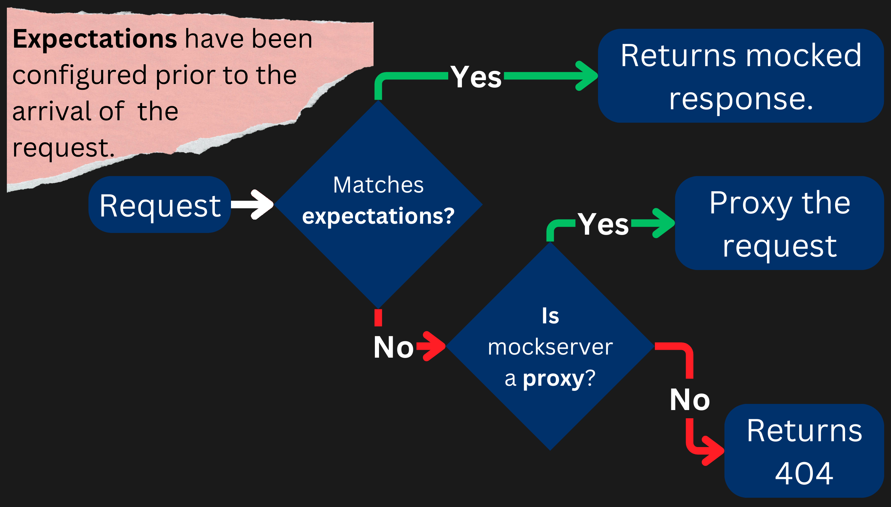

# MockServer

- Mocks integrated systems via HTTP or HTTPS:
  - Configure it to return specific responses for different requests.
  - Can be used as a proxy to record and optionally modify requests and responses.
  - Can be both of the previous ones.

## Infographic of MockServer



With MockServer we can:

- Return a mock response when a request matches an _expectation_.
- Forward a request when the request matches an _expectation_.
- Execute a callback when a request matches an _expectation_ (dynamic mocked response).
- Return an invalid response or close the connection when a request matches an _expectation_.
- Verify requests have been sent.
- Retrieve logs, requests or expectations to help **debug**.

## Proxying

We are doing this for integration and e2e tests.

> [!IMPORTANT]
>
> HTTP client should **send requests to the MockServer**. Not the actual service.
>
> - Here by "HTTP client" we mean things like [another microservice api](microservices/complex-reservation-rabbitmq/apps/payment-service/src/configs/stripe.config.ts).

## GUI

You can see logs, active expectations, requests received, proxied requests in the dashboard. Open this address in your browser:
localhost:1081/mockserver/dashboard

## SSL

MockServer can present a valid X.509 Certificates for any hostname.

## Compose

```yaml
services:
  mockserver:
    image: mockserver/mockserver:5.15.0
    restart: on-failure:3
    ports:
      - 1081:1080
```

## Read more

- [My post on dev.to about testing stripe with MockServer](https://dev.to/kasir-barati/test-stripe-with-mockserver-57mo).
