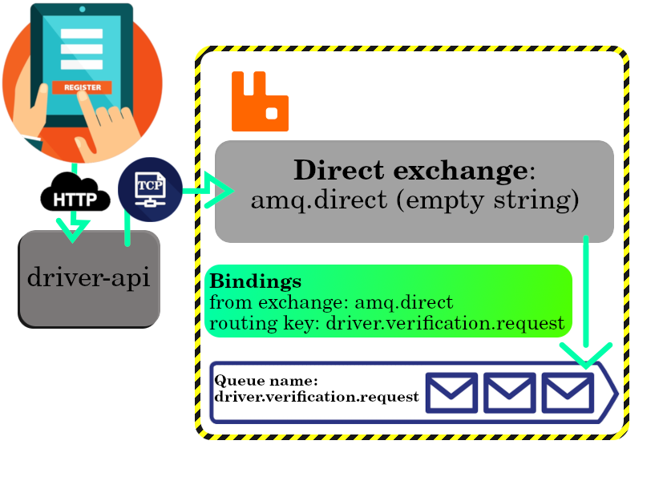

# RabbitMQ

- A reliable general-purposed message broker.
  - Allow [producers](./glossary.md#producer) to send messages to [consumers](./glossary.md#consumer).
- Easy to deploy on cloud environments, on-premises, and on your local machine.
- Prioritizes end-to-end message delivery.
- **In RabbitMQ, the producer sends and monitors if the message reaches the intended consumer.**
  - This is exactly why I had [this bug](../debugging/README.md#rabbitmqBugForQueueOptions).
  - Think of RabbitMQ as a post office that receives mail and delivers it to the intended recipients.
- Consumer application takes a passive role and waits for the RabbitMQ broker to push the message into the queue.
  - E.g. a banking application might wait for SMS alerts from the central transaction processing software.
- [FIFO](./glossary.md#fifo) is the default message ordering.
- Producers can escalate certain messages by using the priority queue.
  - Instead of FIFO broker processes higher priority messages ahead of normal messages.
  - E.g. a retail application might queue sales transactions every hour. However, if the system administrator issues a priority backup database message, the broker sends it immediately.
- Once a message is read, the consumer sends an acknowledgement (ACK) reply to the broker, which then deletes the message from the queue.
  - Networks are unreliable and applications may fail to process messages therefore the _AMQP 0-9-1 model_ has a notion of message acknowledgements.
- Supports low latency.
- Provides complex message routing/distribution with simple architecture.
- Its performance averages up to **thousands of messages per second**.
  - Might slow down if RabbitMQ's queues are [congested](https://dictionary.cambridge.org/dictionary/english/congestion).
- Comes with administrative tools to manage user permissions and broker security ([learn more here](https://www.rabbitmq.com/docs/access-control)).
- Fault-tolerant platform.
  - Can replicate queued messages across distributed nodes in a cluster.
- Can be scaled both horizontally and vertically.
- Can leverages techniques like _RabbitMQ consistent hash exchange_ to balance load processing across multiple brokers.
- Supports different protocols. We usually tend to use [_AMQP 0-9-1 protocol_](./glossary.md#amqp).
- A simple analogy of RabbitMQ:

  

## Use cases or scenarios suitable for RabbitMQ

<table>
  <thead>
    <tr>
      <th>Category</th>
      <th>Example</th>
    <tr>
  </thead>
  <tbody>
    <tr>
      <td>Broadcast events.</td>
      <td>
        Massively multi-player online (MMO) games can use it for leaderboard updates or other global events.
      </td>
    </tr>
    <tr>
      <td>Send notifications.</td>
      <td>
        Sport news sites can use fanout exchanges for distributing score updates to mobile clients in near real-time.
      </td>
    </tr>
    <tr>
      <td>Distributing data relevant to specific geographic location.</td>
      <td>
        Delivering data that is specific to certain physical locations, like stores, to those locations for use in activities such as sales, inventory management, or customer interactions.
      </td>
    </tr>
    <tr>
      <td>Background task processing done by multiple workers, each capable of handling specific set of tasks.</td>
      <td>
        Like processing an uploaded video, you could have multiple services that are performing different form of processing; one is generating subtitles for it, one is trying to categorize it, one is generating different qualities of it, etc.
      </td>
    </tr>
  </tbody>
</table>

## RabbitMQ components or [AMQP entities](./glossary.md#amqpEntities)

AMQP 0-9-1 is a **programmable protocol**, i.e. developer defines the queues, routing keys, exchanges, bindings and other relevant configurations, not a broker administrator.

- **Exchange**:
  - Messages in RabbitMQ won't be send directly to the queue.
  - This component called "exchange" receives messages from the producer and determines where they should be routed to.
- **Queue**: a storage that receives messages from an exchange and sends them to consumers.
- **Binding**: a path that connects an exchange and a broker.

The routing algorithm used depends on the exchange type and bindings.

### Exchange

- <a id="exchangeTypes" href="#exchangeTypes">#</a> We can specify exchange type to route messages to different queues.

  - <a id="directExchangeType" href="#directExchangeType">#</a> **Direct**:

    - Default one.
    - Route a message to a queue by just looking at its _routing key_.
    - It has one special property that makes it very useful for simple applications: every queue that is created is automatically bound to it with a routing key which is the same as the queue name.
      - Default one does not have a name (empty string) or amq.direct.
    - **NOTE**: `bind`/`unbind` operations ain't allowed.
    - Ideal for the unicast routing of messages, though it can be used for multicast routing as well.

    Here is a little example: we are assuming that a customer asks to register as a driver in our "No Taxi No Fun" platform, so to verify them we are gonna have publish a message to the `deriver.verification.request`. Learn about its implementation details [here](../../../microservices/no-taxi-no-fun/README.md#direct-exchange-scenario).

    

  - <a id="topicExchangeType" href="#topicExchangeType">#</a> **Topic**:

    - Route the messages to one or more than one queue based on the _routing key_.
    - We look for the same pattern as the _routing key_, provided in the message.
    - _routing key_ here is a list of words delimited by period.
    - Need multiple consumers/applications to selectively choose which type of messages they want, the consider this exchange type as a potential answer: Stocks price updates (and updates on other kinds of financial data).
    - Used to implement publish/subscribe pattern.
    - We have wild card topic exchanges:

      And here customer needs to have a large taxi but does not care about its type.

      

    - And exact matches, i.e. the _routing key_ should match it exactly:

      But in this example they do care about the taxi type. In fact they like to use a taxi which is environmentally-friendly.

      

  - <a id="fanoutExchangeType" href="#fanoutExchangeType">#</a> **Fanout**:

    - Here RabbitMQ exchange copies the received message and send it out to all queues that have been bound to that exchange.

    

  - <a id="headersExchangeType" href="#headersExchangeType">#</a> **Headers**:

    - Ignores the _routing key_.
    - Similar to topic exchanges.
    - For routing on multiple attributes that are more easily expressed as message headers than a _routing key_.
    - `x-match` header is necessary in case of multiple headers.
      - Accepts two values: `any` or `all`.
      - When it is `any` it will push it to the queue as long as one of the headers matches.

    For example the reporting service wanted to build reports of the taxis. So here we need to have a report of all taxis around Manhattan, keeping track of their fuel consumption and miles traveled.

    

    Or you might wanna have only for the ones that are working inside the New York and won't go beyond that.

    

- Declared with a number of attributes:
  - Name.
  - [Exchange type](#exchangeTypes).
  - Durability (exchanges survive broker restart).
  - Auto-delete (exchange is deleted when last queue is unbound from it).
  - Arguments (optional, used by plugins and broker-specific features).

### Queue

- Store messages.
- Declaring a queue will cause it to be created if it does not already exist.
  - No effect if the queue does already exist, and its attributes are the same as those in the declaration.
- When the existing queue attributes are not the same as those in the declaration a channel-level exception with code 406 (`PRECONDITION_FAILED`) will be raised ([experienced it here](../debugging/README.md#rabbitmqBugForQueueOptions)).
- Up to 255 bytes of UTF-8 characters.
- AMQP 0-9-1 broker can generate a unique queue name on behalf of an app.
  1. Pass an empty string.
  2. Generated name will be returned to the client with queue declaration response.
- Queue names starting with `amq.` are reserved.
  - Attempt to create one and you'll get a 403 (`ACCESS_REFUSED`) error code.

### Binding

- Rules that exchanges use (among other things) to route messages to queues.
- To instruct `exchangeA` to route messages to a `queueA`, `queueA` has to be bound to `exchangeA`.

## Message attributes

- Message meta-data.
  - **Routing key**: A message attribute that is used to route messages from an exchange to a specific queue. Routing key acts like a filter.
    1. A producer sends a message to an exchange. This message includes a _routing key_ as part of it.
    2. The exchange then uses this _routing key_ to determine which queue the message should be delivered to.
  - Some of them are used by the message broker itself and rest of it is completely [opaque](https://dictionary.cambridge.org/dictionary/english/opaque#google_vignette) to the message broker.
  - **Content type**: can be used similar to `content-type` header in HTTP.
  - **Content encoding**: can be treated in the same fashion as `content-encoding` header in HTTP.
  - **Message priority**.
  - **Expiration period**.
  - **Publisher application id**.
  - **Message publishing timestamp**.
  - **Delivery mode (persistent or not)**:
    - Should I persist them to disk or not.
    - A durable exchange or durable queue doesn't make a message persistent: only by specifying it at the message level we can have persistent messages.
  - **payload**:
    - The data that they carry.
    - Broker will not inspect or modify the payload; treats it as an opaque byte array.
    - Common to use serialisation formats like JSON.
- Optional attributes are known as `headers`; similar to `x-headers` in HTTP.
- Set when a message is published.

## Message rejection

- Can reject a message.
- Specify whether you wanna requeue it or just discard it.
  - Be wary of infinite requeuing.

## Consumer

- Two means of consuming published messages:
  1. Subscribe to have messages delivered to you (push API).
  2. Polling (pull API) which is not recommended at all.
- Can have more than one consumer per queue.
- Can register an exclusive consumer. It excludes all other consumers from the queue while that consumer is consuming.
- Each consumer (subscription) has an identifier called a consumer tag.
  - They're just strings.
  - Can be used to unsubscribe from messages.

## Acknowledgement

- There are two acknowledgement modes:
  1. **Automatic acknowledgement**: after broker sends a message to an application (using either `basic.deliver` or `basic.get-ok` method).
  2. **Explicit acknowledgement** :after the application sends back an acknowledgement (using the `basic.ack` method).
- Can perform negative acknowledgement or `nack`.
  - It can reject multiple messages or just a single message.

## Channels

- Instead of many TCP connections to the RabbitMQ open at the same time we can use channels.
- AMQP 0-9-1 connections are multiplexed with channels.
- Think of it as lightweight connections that share a single TCP connection.
- Communication on a particular channel is completely separate from communication on another channel.
- Open a new channel per thread/process and do not share channels between them.

## vhosts

- Host multiple isolated environments (groups of users, exchanges, queues and so on) on a single broker.
- Specify what `vhosts` you wanted to use during connection negotiation.

# Refs

- [AMQP 0-9-1 Model Explained](https://www.rabbitmq.com/tutorials/amqp-concepts).
- [RabbitMQ Explained - Exchanges](https://youtu.be/o8eU5WiO8fw?si=bi50jN9kUIrjrKIa).
