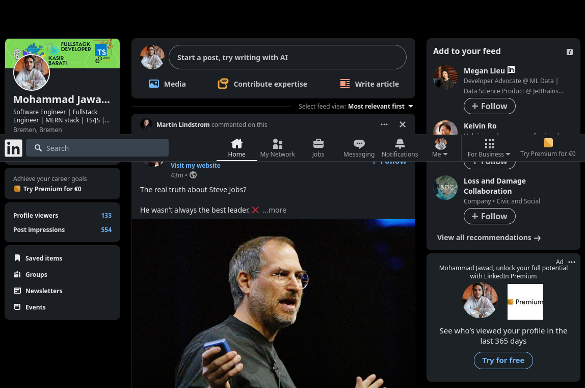

# Pagination

- Glossed over in introductory tutorials.
- A philosophical question: "why we need tp paginate our data set?"
  - UX concern: too many items to display.
    - Can be solved in frontend.
  - Performance concern: too many items to load.
    - Needs our backend to be involved.
    - What we will talk about here.

> [!IMPORTANT]
>
> Here I did not go into details about pagination in SQL and what kind of issues you need to be aware of in SQL since I have written an extensive comprehensible doc [here](https://github.com/kasir-barati/sql/blob/main/.github/docs/select/pagination.md) for it.

## Pagination from a user's perspective

- Numbered pagination:

  

  - Something stays in a page for a certain amount of time usually.
  - Easiest tom implement with technologies we have:
    - Easy to query data.
    - Maps easily on to REST and GraphQL.

- Sequential pagination:

  

  - New pages will be added too fast, thus it does not make sense to number them.
  - Most common.

- Infinite scroll pagination:

  

  - Feeds.
  - Page is not important.
  - Scroll to get more info.
  - Most common.

## 3 kinds of pagination from a technical point of view

1.  <a href="#cursorBasedPagination" id="cursorBasedPagination">#</a> Server-driven pagination (cursor-based pagination):
    - This gives our server more control and can be utilized where we are serving different clients and server is not up to the task of dealing with pagination on top of other tasks it has to complete.
    - In the example above the `nextLink` is URL to the next page,
      - It can contains query strings.
      - It can be the ID of next element, or `offset`.
    - Note: It is best to keep the cursor opaque:
      - Cursor's internal representation or meaning is hidden and not meant to be understood or relied upon by clients..
      - Encode the cursor with a base64 algorithm.
    - No `nextField` means that we've reach the end of the road.
    - You can see how it is done in GraphQL [here](https://github.com/kasir-barati/graphql/tree/main/docs/best-practices/pagination.md).
2.  Client-driven pagination (offset-based pagination): enables our client to have a finer grasp over what is being returned. Good for when we have a very tight requirements in our client app.
3.  Or we can use both.

### Numbered pagination (`OFFSET` & `LIMIT`)

**Filtering, sorting, and paginating**:

1. Server must evaluate the filtering first (so we have applied filters).
2. We need to apply `order by`s specified by client.
   - **Caution**: Order by is supper expensive. So you might wanna consider to not implement it.
3. We can skip part of it.
   - **Caution**: It's easy to skipping an item.
   - **Caution**: It's easy to display same data twice!
4. Lastly we wanna return the page that user have asked for it.

I am not totally sold on the idea that these SQL/MongoDB queries but nonetheless I thought it would be really helpful:

```sql
// users
SELECT *
FROM users
WHERE status = 'active'
ORDER BY created_at DESC, username ASC
LIMIT 10
OFFSET 20;

# total
SELECT COUNT(*)
FROM users
WHERE status = 'active';
```

```js
db.collection("users")
  .find({ status: "active" })
  .sort({ created_at: -1, username: 1 })
  .skip(20)
  .limit(10);
```

```http
GET https://meta.discourse.org/latest.json?page=2
```

Page info:

- Page number: 3. Thus starting after item 20
- Page size/limit: 10.

### Cursor-based pagination

- We just specify the place in the list we want to begin, and then how many items we want to fetch?
- We have a constant pointer to the specific spot where we left off. This pointer is called a cursor.

```http
https://www.reddit.com/
https://www.reddit.com/?count=25&after=t3_49i88b
```

Again read [this doc](https://github.com/kasir-barati/sql/blob/main/.github/docs/select/pagination.md) for an in-depth explanation.

### Relay pagination

For this you can learn more [here](https://github.com/kasir-barati/graphql/blob/main/docs/best-practices/pagination.md).

## Ref

- [Understanding pagination: REST, GraphQL, and Relay](https://www.apollographql.com/blog/understanding-pagination-rest-graphql-and-relay).
