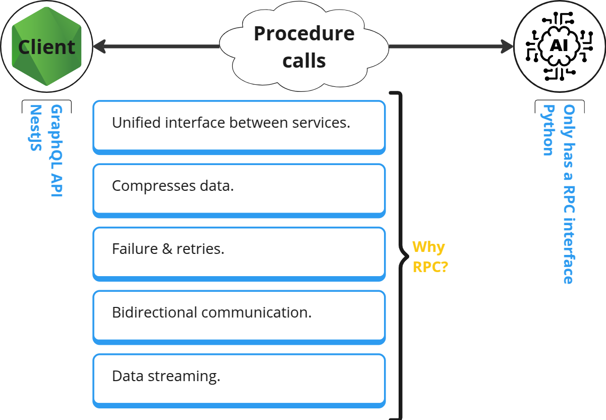
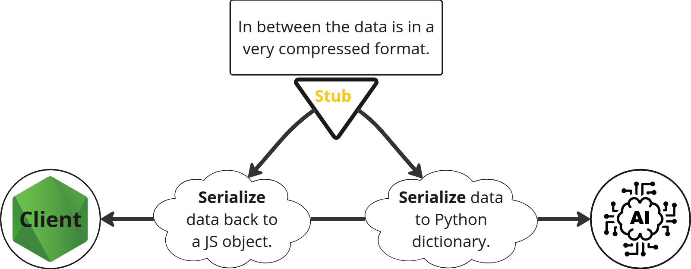

# RPC

- It stands for Remote Procedure Call.
- A communication mechanism.
- It is almost the same as though we have access to the methods/function defined in another program.
- Can be used for inter-service communications.
- Supper efficient.



> [!CAUTION]
>
> This is still a network call. So do not call it like your codes who are living in the same codebase.

- What the heck is stub?
  

  In gRPC we call them `protobuf`. More on that [here](./protobuf.md).

> [!NOTE]
>
> We can use any application level protocol for sending requests and receiving responses:
>
> - TCP: HTTP1, HTTP2.
> - UDP.
> - Websockets.
> - etc.

## gRPC

- An open-source rewrite of RPC used by Google.
- Why gRPC?
  1. It uses only HTTP2 as its transport layer.
  2. [Protocol buffer](./protobuf.md) as our data exchange format.
- No browser support yet, but a good thing to have for inter-service communication in a microservice architecture.

## NestJS

1. Follow [the official documentation](https://docs.nestjs.com/microservices/grpc) opn how to bootstrap a NestJS app + gRPC.
   ```bash
   pnpx create-nx-workspace grpc --preset=nest --appName nestjs-client --bundler esbuild --packageManager pnpm --nxCloud skip
   ```
2. I also love perfectionist for a good reason and that is the tidiness it gives you for little conf, so I highly recommend you take a look at it in their [official doc](https://perfectionist.dev/guide/getting-started).

   **Or if you're looking for something on how to get up to speed I guess [this commit](https://github.com/kasir-barati/docker/commit/6855598149c21c985387fce674a4d1ce5f87ca5f) can be a real quick intro to how to use it. BTW I appreciate it if you give my repo a star in case it was helpful :slightly_smiling_face:.**

   ```bash
   nx run-many -t lint --fix
   ```

3. Write you're protobuf file like what I did [here at `user.proto`](../../microservices/grpc/apps/nestjs-client/src/assets/user.proto).
4. Use the [`ts-proto`](https://github.com/stephenh/ts-proto) to auto generate the interfaces and decorators for your gRPC controller.

   ```json
   {
     "scripts": {
       "grpc:gen": "npx protoc --plugin=./node_modules/.bin/protoc-gen-ts_proto --ts_proto_opt=fileSuffix=.interface --ts_proto_opt=nestJs=true --ts_proto_opt=addNestjsRestParameter=true --ts_proto_out={projectRoot}/src/assets/interfaces -I {projectRoot}/src/assets/ {projectRoot}/src/assets/*.proto"
     }
   }
   ```

   **For the complete solution look at [this](../../microservices/grpc/apps/nestjs-client/project.json).**

5. Now just run the `npm run grpc:gen` or if you're using Nx just run `nx grpc:gen projectName`.

6. Congrats, you have your types and decorators. So let's [put them into use](../../microservices/grpc/apps/nestjs-client/src/user/user.grpc-controller.ts).

> [!TIP]
>
> For a complete example look at the [`nestjs-client`](../../microservices/grpc/).

## Ref

- [Introduction to RPC - Remote Procedure Calls](https://www.youtube.com/watch?v=eRndYq8iTio).
