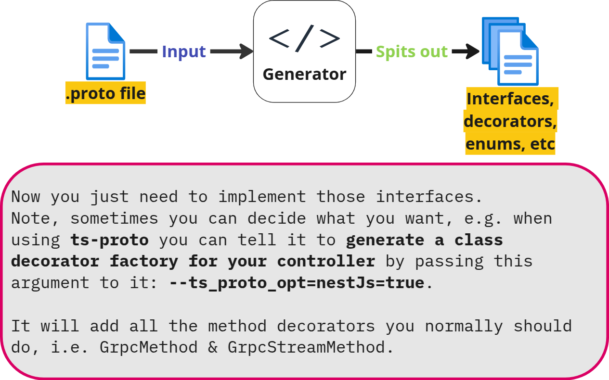

# Protobuf

- A common way of **declaring** a function which is gonna be part of a service + what it expects from the caller to pass to it.
  - Common as in platform agnostic and programming language agnostic.
- Human-readable.
- Think of it this way:
  - We'll have some interfaces which needs to be implemented (in other words it's our Interface Definition Language (**IDL**)).
  - Encode and decode data in order to be sent over the wire.
- Then we have a generator. E.g. [`ts-proto`](https://github.com/stephenh/ts-proto)
  
- An ordinary text file with a `.proto` extension.

> [!NOTE]
>
> We can use something like JSON as our data exchange format, but `.proto` files have several advantages which make them a better candidate for the job.

## How It Works

1. Define the structure for the data you wanna serialize in a proto file.

   ```proto
   message Person {
     int32 id = 1;
     string name = 2;
     bool is_active = 3;
   }
   ```

   `message`: a small logical record of information containing a series of name-value pairs called fields

2. Use [`protoc`](https://github.com/protocolbuffers/protobuf) to generate data access classes in your preferred language from your `.proto` definition.

   > [!TIP]
   >
   > Though they are supporting JS, but if you need TS interfaces, etc you need to turn to some other libraries such as [`ts-proto`](https://github.com/stephenh/ts-proto).

   ```bash
   ts-protoc --ts_proto_out=./output -I=./protos ./protoc/*.proto --ts_proto_opt=addGrpcMetadata=true --ts_proto_opt=addNestjsRestParameter=true --ts_proto_opt=nestJs=true --ts_proto_opt=exportCommonSymbols=false
   ```

   Learn more [here](https://github.com/stephenh/ts-proto/blob/main/NESTJS.markdown).
