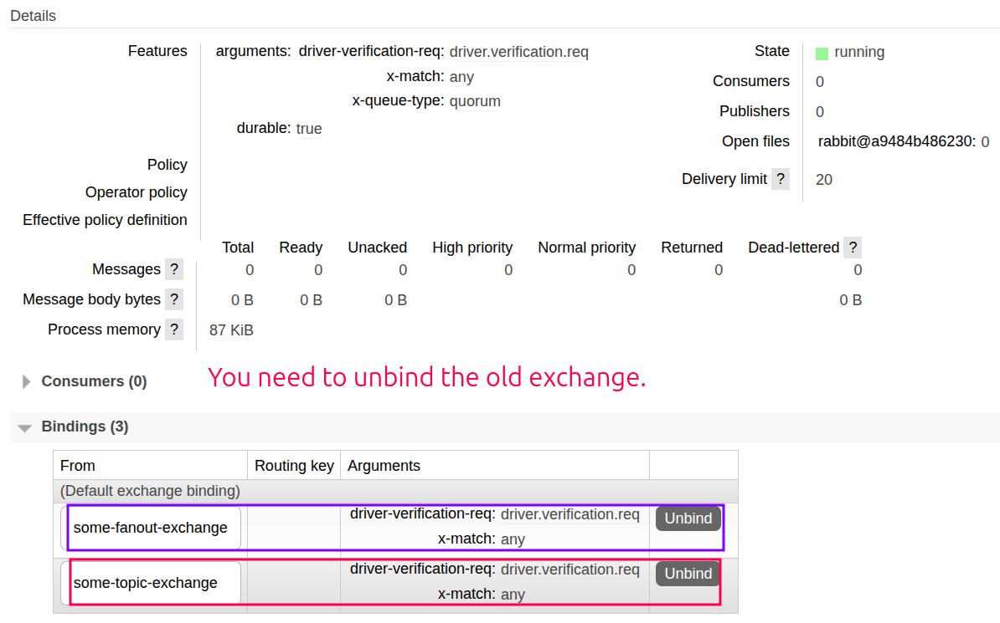

# Updating Queue

- You **CANNOT** change an existing queue's:
  - `x-delivery-limit` argument.
  - Type (e.g. `quorum` to `classic` or vice versa)!
- But you can change these settings of an existing queue:
  - Routing key.
  - Exchange (basically it is adding the new binding to the list of existing bindings).
  - And policies.

