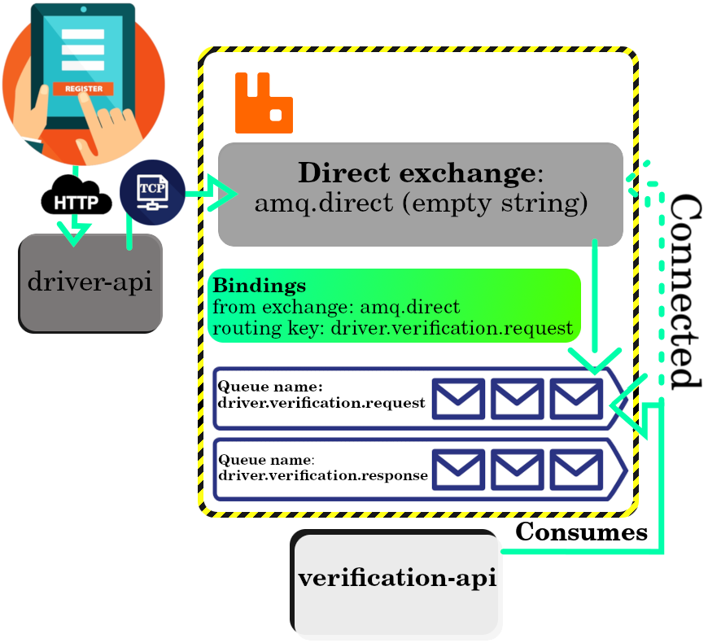
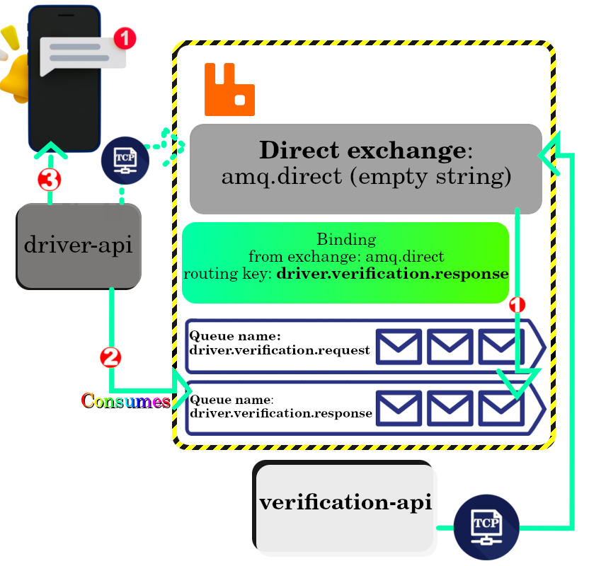

# No Taxi No Fun

Here I will try to implement Direct exchange type explained [here](../../.github/docs/rabbitmq/README.md#directExchangeType). So to implement that scenario I need to have these microservices:

## Direct exchange scenario

1. _driver-api_.
   - Have these endpoints:
     - Create a taxi driver.
     - Read a taxi driver.
   - Consumes messages published as what is the result of driver's verification.
2. _verification-api_.
   - Have these endpoints:
     - Read all verifications.
   - Consumes messages published by the `driver-api`, requesting to initiate the verification process for the new driver.
   - It also publishes messages that specifies how was the result of driver verification.

### The workflow

